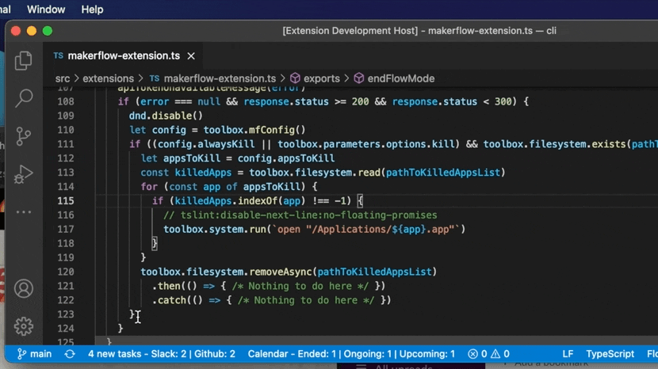
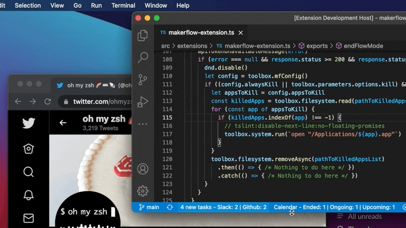

# Makerflow 💻 🌊

Makerflow is a deep work  and collaboration assistant for developers. Get in the zone without 
hiding away from your product manager, designer or other developers on the team!

## Table of contents

1. [Features](#features)
1. [Installation](#installation)
1. [Usage](#usage)
   1. [Flow Mode](#flow-mode)
   1. [Tasks](#tasks)
   1. [Breaks](#breaks)
   1. [Events (from Google Calendar)](#events-from-google-calendar)

## Features

#### With a [single command or click](#flow-mode) you can:
1. 🔕 Toggle "Do Not Disturb" mode on macOS.
1. 🙅 Close/open distracting chat apps like Slack, Discord, MS Teams, Telegram, WhatsApp, and Messages.
1. 🛑 Block/unblock distracting websites with [Chrome](https://chrome.google.com/webstore/detail/codmnedpgifnlanopnolihpobepaafic) or [Firefox](https://addons.mozilla.org/en-US/firefox/addon/makerflow/) extensions
1. 💬 Update/clear your Slack status automatically to let your co-workers know when 
   1. you are trying to do deep work and will be slow to respond. Status is set to 💻
   1. or, when you are on a [break](#breaks). Status is set to one of these emojis ☕️ 🍵 🥪 🥤 🚶 🏃 💪 🏥 👶 ⏸

#### Plus, other commands and status bar items to
1. 📋 Get a list of your [tasks](#tasks) like pull requests from GitHub or Bitbucket
1. ✅ and mark them as done
1. 📅 See all your ongoing and upcoming [events from Google Calendar](#events-from-google-calendar)
   1. and launch Google Meet meetings directly from VS Code 🎥 🚀

## Installation

Note, that this extension also installs the [Makerflow CLI](https://www.npmjs.com/package/makerflow-cli) tool with `npm install -g makerflow-cli` upon initialization.

### Pre-requisites

1. MacOS. 
1. A free Makerflow account. Sign up at https://makerflow.co
1. API token from https://app.makerflow.co/settings#api

## Usage

### Flow Mode

Starting Flow Mode will: 
1. 🔕 Turn on "do-not-disturb" mode on macOS to block your notifications and 
   prevent distractions.
1. 💬 If you have your Slack workspace connected to Makerflow, it will automatically set your 
   Slack status to let your teammates know you might be slow to respond.
1. 🙅 Close distracting chat apps like Slack, Discord, MS Teams, Telegram, WhatsApp, and Messages if you configured it to do so with `makerflow config kill` in your terminal.
1. 🛑 Block distracting websites if you have Makerflow [Chrome](https://chrome.google.com/webstore/detail/codmnedpgifnlanopnolihpobepaafic) or [Firefox](https://addons.mozilla.org/en-US/firefox/addon/makerflow/) extensions installed.

Stopping Flow Mode will reverse all the above actions.

#### Demo

### Tasks

Tasks show up in Makerflow by connecting with your other collaboration tools like Slack, GitHub or Bitbucket.

You can connect these tools with Makerflow from the "[Setup Integrations](https://app.makerflow.co/integrations)" page on the website.

#### Demo

### Breaks

Breaks are a quick way to set your Slack status and let your coworkers know when you are 
away on a break.

If you don't supply a reason, your status will be set to ⏸.

Reasons currently supported are lunch (🥪), coffee (☕️), tea (🍵), beverage (🥤), walk (👟), run (🏃), workout (💪), 
child (👶), and doctor (🏥).

#### Demo

### Events (from Google Calendar)

Will list recently ended, ongoing and upcoming events from Google Calendar.

#### Demo

